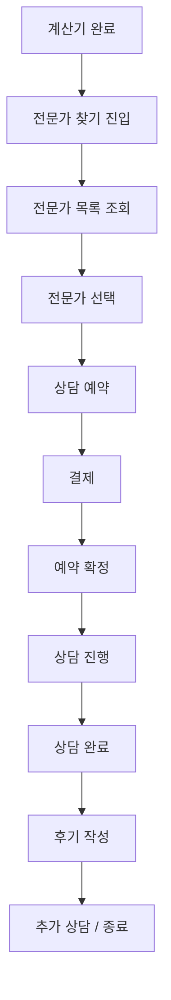

# 📋 전문가 찾기 고객 여정 (Customer Journey)

**문서 버전**: 1.0  
**작성일**: 2025년 8월 27일  
**최종 업데이트**: 2025년 8월 27일

---

## 📊 개요

플랜비 전문가 상담 서비스의 전체 고객 여정을 단계별로 정의하고, 각 단계별 구현 현황과 미완성 기능을 파악하여 개발 우선순위를 설정합니다.

---

## 🎯 고객 여정 전체 플로우

---

## 📝 단계별 상세 여정

### 🧮 **Step 0: 계산기 완료 (선행 조건)**
**목적**: 개인화된 데이터 준비  
**구현 상태**: ✅ **완료**

#### 사용자 행동
- 6단계 은퇴생활비 계산기 완료
- 개인별 재정 상황 파악
- 결과 화면에서 "전문가 상담" 버튼 노출

#### 시스템 동작
- 계산 결과를 localStorage 및 DB 저장
- 개인화된 상담 추천 준비
- 전문가 매칭을 위한 데이터 준비

#### 구현 현황
✅ **완성도 100%**
- 계산기 6단계 모든 기능 구현
- 결과 저장 및 복원 기능
- 전문가 상담 유도 UI

---

### 🔍 **Step 1: 전문가 찾기 진입**
**목적**: 사용자를 전문가 상담으로 연결  
**구현 상태**: ✅ **완료**

#### 사용자 행동
- 계산기 결과 화면에서 "전문가 찾기" 탭 클릭
- 또는 메인 메뉴에서 "전문가 상담" 접근
- 게스트의 경우 회원가입 유도 모달

#### 시스템 동작
- 전문가 찾기 화면 표시
- 사용자 인증 상태 확인
- 계산 결과 데이터 연동 준비

#### 구현 현황
✅ **완성도 100%**
- 탭 기반 네비게이션 완성
- 게스트 제한 및 회원가입 유도 완성
- 계산 결과 연동 완성

---

### 👥 **Step 2: 전문가 목록 조회**
**목적**: 적합한 전문가 발견 및 선택 지원  
**구현 상태**: ✅ **완료**

#### 사용자 행동
- 전문가 목록 스크롤 및 탐색
- 전문가 프로필 카드 상세 정보 확인
- 자격증, 경력, 전문분야, 상담료 비교
- 평점 및 후기 확인

#### 시스템 동작  
- 검증된 전문가 목록 표시 (status='active', is_verified=true)
- 전문가별 상세 정보 로드
- 평점 및 후기 통계 표시
- 상담료 및 상담 방식 표시

#### 구현 현황
✅ **완성도 95%**
- 전문가 목록 조회 완성
- 프로필 카드 UI 완성  
- 평점/후기 시스템 DB 설계 완료
- ⚠️ **미완성**: 실제 후기 데이터 표시

---

### 🎯 **Step 3: 전문가 선택 및 상세보기**
**목적**: 최적 전문가 선택을 위한 상세 정보 제공  
**구현 상태**: ⚠️ **부분 완료 (70%)**

#### 사용자 행동
- 전문가 프로필 상세 페이지 접근
- 전문가 소개, 경력, 상담 사례 확인
- 상담 가능 시간대 확인
- 상담료 및 상담 방식 최종 확인

#### 시스템 동작
- 전문가 상세 프로필 표시
- 상담 가능 시간표 표시
- 해당 전문가의 후기 목록 표시
- 예약 가능한 시간대 실시간 확인

#### 구현 현황  
⚠️ **완성도 70%**
- ✅ 기본 프로필 정보 표시
- ✅ 상담료 및 상담 방식 표시
- ❌ **미완성**: 상담 가능 시간표 (캘린더 UI)
- ❌ **미완성**: 전문가별 상세 후기 목록
- ❌ **미완성**: 실시간 예약 가능 시간 확인

**📋 필요 구현 사항:**
1. 전문가별 상세 프로필 모달/페이지
2. 주간/월간 상담 가능 시간 캘린더
3. 예약 현황 실시간 동기화
4. 전문가별 후기 필터링 및 표시

---

### 📅 **Step 4: 상담 예약**
**목적**: 원하는 시간에 상담 예약 완료  
**구현 상태**: ❌ **미완성 (30%)**

#### 사용자 행동
- 상담 날짜 및 시간 선택
- 상담 방식 선택 (전화/화상/채팅)
- 상담 주제 및 질문 사항 입력
- 연락처 확인 및 수정
- 예약 정보 최종 확인

#### 시스템 동작
- 선택 가능한 시간대만 표시
- 예약 충돌 방지 (동시 예약 차단)
- 예약 정보 임시 저장 (15분 유지)
- 전문가에게 예약 요청 알림 발송
- 사용자에게 예약 진행 안내

#### 구현 현황
❌ **완성도 30%**
- ✅ 기본 예약 UI 스케치 존재
- ✅ 데이터베이스 스키마 설계 완료 (consultation_sessions 테이블)
- ❌ **미완성**: 캘린더 기반 날짜/시간 선택 UI
- ❌ **미완성**: 상담 방식별 차별화 (전화/화상/채팅)
- ❌ **미완성**: 예약 충돌 방지 로직
- ❌ **미완성**: 임시 예약 관리 시스템
- ❌ **미완성**: 예약 요청 알림 시스템

**📋 필요 구현 사항:**
1. **React Calendar 또는 FullCalendar 연동**
2. **시간대별 예약 가능 여부 실시간 체크**
3. **예약 요청 워크플로우 (요청→승인→확정)**
4. **예약 변경 및 취소 기능**
5. **이메일/SMS 알림 시스템**

---

### 💳 **Step 5: 결제**
**목적**: 상담료 결제 및 예약 확정  
**구현 상태**: ❌ **미완성 (0%)**

#### 사용자 행동
- 결제 방법 선택 (카드/계좌이체/간편결제)
- 결제 정보 입력
- 약관 동의 (결제 취소 정책, 환불 정책)
- 최종 결제 승인
- 결제 완료 확인

#### 시스템 동작
- PG사 연동 결제 페이지 표시
- 결제 검증 및 승인 처리
- 결제 완료시 예약 상태 '확정'으로 변경
- 전문가 및 사용자에게 확정 알림 발송
- 결제 내역 저장 및 영수증 발행

#### 구현 현황
❌ **완성도 0%**
- ❌ **미완성**: PG사 연동 (토스페이먼츠/KG이니시스)
- ❌ **미완성**: 결제 UI 구현
- ❌ **미완성**: 결제 검증 로직
- ❌ **미완성**: 결제 완료 처리 워크플로우
- ❌ **미완성**: 환불 처리 시스템
- ❌ **미완성**: 세금계산서 발행

**📋 필요 구현 사항:**
1. **토스페이먼츠 또는 KG이니시스 SDK 연동**
2. **결제 UI 컴포넌트 개발**
3. **결제 성공/실패 처리 로직**
4. **환불 정책 및 자동 환불 시스템**
5. **부가가치세 계산 및 세금계산서 발행**
6. **PCI DSS 보안 기준 준수**

---

### ✅ **Step 6: 예약 확정 및 준비**
**목적**: 상담 준비 및 리마인더 제공  
**구현 상태**: ❌ **미완성 (20%)**

#### 사용자 행동
- 예약 확정 알림 수신
- 상담 전 준비사항 확인
- 상담 링크 또는 연락처 수신
- 상담 질문 사항 추가 작성
- 상담 1일 전/1시간 전 리마인더 확인

#### 시스템 동작
- 예약 확정 이메일/SMS 발송
- 상담 방식별 접속 정보 제공
- 상담 전 체크리스트 안내 
- 자동 리마인더 스케줄링
- 상담실 링크 생성 (화상 상담시)

#### 구현 현황
❌ **완성도 20%**
- ✅ 데이터베이스 스키마 준비
- ❌ **미완성**: 이메일/SMS 발송 시스템
- ❌ **미완성**: 상담 방식별 접속 정보 관리
- ❌ **미완성**: 리마인더 스케줄링 시스템
- ❌ **미완성**: 화상 상담용 WebRTC 룸 생성

**📋 필요 구현 사항:**
1. **이메일 템플릿 시스템 (예약 확정, 리마인더)**
2. **SMS 발송 API 연동 (누리고 API 등)**
3. **상담 방식별 접속 방법 관리**
4. **자동 리마인더 스케줄링 (cron job)**
5. **화상 상담용 WebRTC 룸 관리**

---

### 💬 **Step 7: 상담 진행**
**목적**: 실시간 전문가 상담 서비스 제공  
**구현 상태**: ⚠️ **부분 완료 (40%)**

#### 사용자 행동
- 상담 시간에 상담실 접속
- 전문가와 실시간 소통
- 추가 질문 및 상담
- 상담 내용 요약 수신

#### 시스템 동작
- 상담 방식별 통신 채널 제공
- 계산 결과 자동 공유
- 상담 시간 추적 및 관리
- 상담 내용 기록 (전문가용)
- 상담 완료 처리

#### 구현 현황
⚠️ **완성도 40%**
- ✅ 기본 채팅 시스템 구현 (ChatComponent)
- ✅ 메시지 실시간 동기화 (Supabase Realtime)
- ✅ 파일 첨부 기능 부분 구현
- ⚠️ **부분 완성**: WebRTC 화상/음성 통화 (기본 구조만)
- ❌ **미완성**: 상담 시간 타이머 및 연장 기능
- ❌ **미완성**: 상담 내용 기록 시스템
- ❌ **미완성**: 상담 품질 모니터링

**📋 필요 구현 사항:**
1. **WebRTC 화상/음성 통화 안정화**
2. **계산 결과 실시간 공유 기능**
3. **상담 시간 관리 및 연장 승인 시스템**
4. **상담 내용 요약/기록 템플릿**
5. **통화 품질 모니터링 및 문제 해결**

---

### 🏁 **Step 8: 상담 완료 및 정리**
**목적**: 상담 마무리 및 후속 조치 안내  
**구현 상태**: ❌ **미완성 (10%)**

#### 사용자 행동
- 상담 완료 확인
- 상담 요약서 수신
- 추천 액션 플랜 확인
- 다음 상담 일정 논의
- 상담실 종료

#### 시스템 동작
- 상담 시간 자동 종료
- 상담 내역 데이터베이스 저장
- 상담 요약서 생성 및 발송
- 후속 상담 추천 알고리즘 실행
- 상담 비용 정산 처리

#### 구현 현황
❌ **완성도 10%**
- ✅ 데이터베이스 스키마 설계
- ❌ **미완성**: 상담 요약서 자동 생성
- ❌ **미완성**: 액션 플랜 템플릿 시스템
- ❌ **미완성**: 후속 상담 추천 로직
- ❌ **미완성**: 자동 정산 시스템

**📋 필요 구현 사항:**
1. **상담 요약서 템플릿 및 자동 생성**
2. **개인별 액션 플랜 생성 시스템**
3. **후속 상담 추천 알고리즘**
4. **전문가 정산 자동화 시스템**

---

### ⭐ **Step 9: 후기 작성 및 평가**
**목적**: 서비스 품질 개선 및 신뢰도 향상  
**구현 상태**: ⚠️ **부분 완료 (60%)**

#### 사용자 행동
- 상담 만족도 평가 (1-5점)
- 상담 후기 텍스트 작성
- 전문가 추천 여부 선택
- 개선 사항 피드백 작성
- 후기 공개 여부 선택

#### 시스템 동작
- 후기 작성 페이지 표시
- 평가 점수 실시간 반영
- 후기 내용 검증 (욕설/스팸 필터)
- 전문가 평점 업데이트
- 우수 후기 하이라이트 처리

#### 구현 현황
⚠️ **완성도 60%**
- ✅ 데이터베이스 스키마 완성 (consultation_reviews 테이블)
- ✅ 평점 자동 업데이트 트리거 구현
- ⚠️ **부분 완성**: 기본 후기 작성 UI
- ❌ **미완성**: 후기 작성 모달/페이지
- ❌ **미완성**: 후기 내용 검증 시스템
- ❌ **미완성**: 전문가 응답 기능

**📋 필요 구현 사항:**
1. **후기 작성 UI 컴포넌트 완성**
2. **텍스트 필터링 시스템 (욕설/스팸 감지)**
3. **전문가 후기 응답 시스템**
4. **후기 신고 및 관리 시스템**

---

### 🔄 **Step 10: 추가 상담 또는 서비스 종료**
**목적**: 지속적인 관계 관리 및 재상담 유도  
**구현 상태**: ❌ **미완성 (5%)**

#### 사용자 행동
- 추가 상담 필요성 검토
- 동일 전문가 재예약 또는 다른 전문가 선택
- 정기 상담 일정 설정
- 서비스 만족도 조사 참여
- 플랜비 서비스 추천

#### 시스템 동작
- 상담 히스토리 분석
- 개인화된 전문가 재추천
- 정기 상담 패키지 제안
- 고객 만족도 조사 발송
- 추천 인센티브 제공

#### 구현 현황
❌ **완성도 5%**
- ✅ 마이페이지 상담 내역 표시
- ❌ **미완성**: 상담 히스토리 분석
- ❌ **미완성**: 개인화된 재추천 시스템
- ❌ **미완성**: 정기 상담 패키지
- ❌ **미완성**: NPS 조사 시스템
- ❌ **미완성**: 추천 인센티브 시스템

**📋 필요 구현 사항:**
1. **상담 히스토리 분석 대시보드**
2. **AI 기반 전문가 재추천 시스템**
3. **정기 상담 구독 모델**
4. **NPS 조사 자동화**
5. **추천 프로그램 및 인센티브 관리**

---

## 📊 전체 구현 현황 요약

| 단계 | 기능 | 구현도 | 상태 | 우선순위 |
|------|------|--------|------|---------|
| **0단계** | 계산기 완료 | 100% | ✅ 완료 | - |
| **1단계** | 전문가 찾기 진입 | 100% | ✅ 완료 | - |
| **2단계** | 전문가 목록 조회 | 95% | ✅ 완료 | Low |
| **3단계** | 전문가 선택/상세 | 70% | ⚠️ 진행중 | High |
| **4단계** | 상담 예약 | 30% | ❌ 미완성 | Critical |
| **5단계** | 결제 | 0% | ❌ 미완성 | Critical |
| **6단계** | 예약 확정 | 20% | ❌ 미완성 | High |
| **7단계** | 상담 진행 | 40% | ⚠️ 진행중 | High |
| **8단계** | 상담 완료 | 10% | ❌ 미완성 | Medium |
| **9단계** | 후기 평가 | 60% | ⚠️ 진행중 | Medium |
| **10단계** | 추가 서비스 | 5% | ❌ 미완성 | Low |

### 📈 전체 완성도
- **전체 평균**: **42%**
- **핵심 기능 (1-7단계)**: **51%**
- **부가 기능 (8-10단계)**: **25%**

---

## 🚨 Critical Path (핵심 경로)

서비스 런칭을 위한 **최소 기능 구현 순서**:

### Phase 1: MVP 완성 (4-6주)
1. **상담 예약 시스템** (4단계) - 2주
2. **결제 시스템** (5단계) - 2주  
3. **예약 확정 및 알림** (6단계) - 1주
4. **채팅 시스템 안정화** (7단계) - 1주

### Phase 2: 서비스 고도화 (2-4주)
1. **전문가 상세 프로필** (3단계) - 1주
2. **상담 완료 처리** (8단계) - 1주
3. **후기 시스템 완성** (9단계) - 2주

### Phase 3: 고급 기능 (장기)
1. **WebRTC 화상 통화** - 3주
2. **AI 추천 시스템** - 4주
3. **정기 상담 패키지** - 2주

---

## 🔧 기술 스택 요구사항

### 프론트엔드 추가 필요
- **React Calendar** 또는 **FullCalendar**: 예약 시스템
- **React Hook Form**: 복잡한 예약 폼 관리
- **WebRTC**: 화상/음성 통화
- **Socket.IO Client**: 실시간 통신 강화

### 백엔드 추가 필요  
- **토스페이먼츠 SDK**: 결제 처리
- **Twilio** 또는 **SendGrid**: SMS/Email 발송
- **Node-cron**: 스케줄링 및 리마인더
- **Redis**: 실시간 데이터 캐싱
- **WebRTC Signaling Server**: P2P 통신

### 인프라 추가 필요
- **TURN/STUN Server**: WebRTC NAT 통과
- **CDN**: 파일 업로드 및 스트리밍
- **Load Balancer**: 실시간 연결 분산
- **Monitoring**: 상담 품질 모니터링

---

## 💰 예상 개발 비용 및 기간

### MVP 개발 (Phase 1)
- **개발 기간**: 4-6주
- **핵심 기능**: 예약 → 결제 → 상담
- **예상 공수**: 200-300 시간
- **우선순위**: Critical

### 서비스 완성 (Phase 2)
- **개발 기간**: 추가 2-4주  
- **완성 기능**: 전체 고객 여정 90% 커버
- **예상 공수**: 100-200 시간
- **우선순위**: High

### 고급 기능 (Phase 3)  
- **개발 기간**: 장기 (3-6개월)
- **차별화 기능**: WebRTC, AI 추천, 구독 모델
- **예상 공수**: 500+ 시간  
- **우선순위**: Medium-Low

---

## 🎯 결론 및 권장사항

### 즉시 착수 필요 (Critical)
1. **상담 예약 시스템**: 캘린더 기반 예약 UI
2. **결제 연동**: 토스페이먼츠 PG 연동
3. **알림 시스템**: 이메일/SMS 발송

### 단기 개발 목표 (High)  
1. **전문가 상세 프로필**: 상세 정보 및 후기 표시
2. **채팅 시스템 완성**: 파일 공유, 상담 기록
3. **상담 완료 처리**: 요약서 생성, 후속 조치

### 장기 비전 (Medium-Low)
1. **WebRTC 화상 통화**: 완전한 원격 상담 환경
2. **AI 개인화**: 전문가 추천 및 상담 효과 분석  
3. **구독 서비스**: 정기 상담 및 프리미엄 기능

현재 구현된 기능들은 견고한 기반을 제공하고 있으며, **Phase 1 MVP 완성에 집중**하여 빠른 시장 진입을 추천합니다.

---

**문서 작성자**: Claude Code AI  
**문서 상태**: 완료  
**다음 업데이트 예정**: Phase 1 개발 완료 후