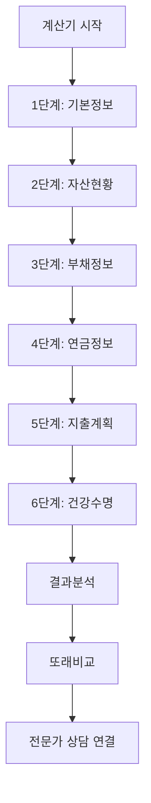

# 📊 플랜비(Plan B) 제품기획서 (PRD)

**Product Requirements Document**  
**Version:** 1.0  
**Date:** 2025년 8월 27일  
**Status:** 개발 완료 (결제/정산 기능 제외)

---

## 📋 목차

1. [제품 개요](#제품-개요)
2. [사용자 정의](#사용자-정의) 
3. [핵심 기능](#핵심-기능)
4. [사용자 플로우](#사용자-플로우)
5. [기술 사양](#기술-사양)
6. [비즈니스 모델](#비즈니스-모델)
7. [성공 지표](#성공-지표)
8. [로드맵](#로드맵)

---

## 📊 제품 개요

### 🎯 제품 비전
**"시니어를 위한 원스톱 은퇴설계 플랫폼"**

플랜비는 50세 이상 시니어들이 안정적인 노후를 준비할 수 있도록 돕는 종합 은퇴설계 서비스입니다. 정확한 생활비 계산부터 동일한 고민을 가진 사람들과의 소통, 전문가 상담까지 원스톱으로 제공합니다.

### 🚀 핵심 가치 제안
- **정확한 은퇴생활비 계산**: 개인의 자산, 연금, 지출 패턴을 종합 분석
- **또래 비교를 통한 현실적 기준**: 비슷한 상황의 사용자들과 비교 분석
- **익명 커뮤니티**: 민감한 재정 정보를 안전하게 공유하며 소통
- **전문가 매칭**: 검증된 재무설계사와의 1:1 상담 연결

### 📈 시장 기회
- **타겟 시장**: 50세 이상 은퇴 준비층 (약 1,200만명)
- **시장 규모**: 국내 재무설계 시장 연 2.5조원
- **성장 동력**: 베이비부머 은퇴, 100세 시대 도래, 디지털 전환 가속

---

## 👥 사용자 정의

### 🎯 주요 사용자 페르소나

#### 1. 김준비 (만 55세, 사무직 과장)
- **현황**: 5년 후 정년퇴직 예정, 자녀 독립 완료
- **자산**: 주택 5억, 예금 2억, 퇴직금 예상 8천만원
- **니즈**: "내가 모은 돈으로 노후가 가능할까?" 정확한 계산 원함
- **행동**: 인터넷 검색, 은행 상담 등 정보 수집 중

#### 2. 박소통 (만 62세, 전업주부)
- **현황**: 남편 은퇴 완료, 연금 수령 시작
- **자산**: 주택 3억, 예금 1.5억, 국민연금 월 120만원
- **니즈**: 비슷한 상황의 사람들과 경험 공유, 현실적 조언
- **행동**: 온라인 커뮤니티 활동, 지인들과 정보 교환

#### 3. 이전문 (만 58세, 개인사업자)
- **현황**: 사업 정리 고민, 불규칙한 수입
- **자산**: 상가건물 7억, 부채 2억, 사적연금 가입
- **니즈**: 복잡한 자산 상황에 대한 전문가 조언 필요
- **행동**: 재무설계사 상담 검토 중

### 📊 사용자 세그멘테이션

| 구분 | 주요 니즈 | 서비스 우선순위 | 예상 비율 |
|------|-----------|----------------|-----------|
| **계산형** | 정확한 수치 파악 | 계산기 → 전문가 상담 | 40% |
| **소통형** | 경험 공유, 정서적 지지 | 커뮤니티 → 계산기 | 35% |
| **전문가형** | 맞춤형 솔루션 | 전문가 상담 → 계산기 | 25% |

---

## ⚡ 핵심 기능

### 🧮 1. 은퇴생활비 계산기

#### 핵심 기능
- **6단계 정밀 계산**: 기본정보 → 자산현황 → 부채정보 → 연금정보 → 지출계획 → 건강수명
- **실시간 결과 분석**: 월 필요 생활비, 자산 소진 시점, 부족액 등 즉시 계산
- **시나리오 분석**: 보수적/균형/적극적 3가지 라이프스타일별 분석
- **또래 비교**: 연령대/자산규모 유사 사용자들과의 비교 통계

#### 기술 구현
```javascript
// 핵심 계산 로직 예시
const calculateRetirementFunds = (formData) => {
  const monthlyExpense = calculateMonthlyExpense(formData.expenses);
  const totalAssets = formData.housing + formData.financial + formData.severance;
  const monthlyIncome = formData.nationalPension + formData.privatePension;
  
  const monthlyShortfall = monthlyExpense - monthlyIncome;
  const yearsUntilDepletion = totalAssets / (monthlyShortfall * 12);
  
  return {
    monthlyRequired: monthlyExpense,
    monthlyShortfall: Math.max(0, monthlyShortfall),
    assetDepletionAge: formData.age + yearsUntilDepletion,
    riskLevel: assessRiskLevel(yearsUntilDepletion)
  };
};
```

#### 사용자 가치
- **정확성**: 개인별 맞춤형 정밀 계산
- **현실성**: 실제 사용자 데이터 기반 또래 비교
- **즉시성**: 복잡한 계산을 5분 내 완료

### 💬 2. 익명 커뮤니티

#### 핵심 기능
- **5개 카테고리**: 은퇴준비, 자산관리, 생활, 건강, 자유주제
- **익명 뱃지 시스템**: 연령대(50대/60대/70대), 자산규모(1억미만/1-3억/3-5억/5억이상), 지역
- **실시간 소통**: 게시글, 댓글, 대댓글, 좋아요 기능
- **검색 및 필터링**: 카테고리, 뱃지별 게시글 필터링

#### 데이터베이스 설계
```sql
-- 커뮤니티 게시글 테이블
CREATE TABLE community_posts (
  id UUID PRIMARY KEY DEFAULT gen_random_uuid(),
  user_id UUID REFERENCES user_profiles(id),
  title TEXT NOT NULL,
  content TEXT NOT NULL,
  category TEXT NOT NULL,
  asset_badge TEXT,
  age_badge TEXT, 
  region_badge TEXT,
  views INTEGER DEFAULT 0,
  likes INTEGER DEFAULT 0,
  created_at TIMESTAMP WITH TIME ZONE DEFAULT NOW()
);
```

#### 사용자 가치
- **안전성**: 실명 노출 없이 민감한 재정 정보 공유 가능
- **신뢰성**: 자산/연령 뱃지로 신뢰할 수 있는 조언 식별
- **접근성**: 언제 어디서나 고민 상담 및 정보 획득

### 👨‍💼 3. 전문가 상담 서비스

#### 핵심 기능
- **전문가 프로필**: 자격증, 경력, 전문분야, 상담료, 후기 등 상세 정보
- **상담 방식**: 텍스트/음성/화상 상담 지원
- **스케줄링**: 전문가별 가능 시간대 확인 및 예약
- **통합 연동**: 계산기 결과를 전문가와 자동 공유

#### 전문가 검증 프로세스
1. **자격 확인**: CFP, AFP, FP, 재무설계사 등 공식 자격증
2. **경력 검증**: 최소 3년 이상 재무설계 경력
3. **서류 심사**: 사업자등록증, 자격증명서, 경력증명서
4. **시범 상담**: 품질 검증을 위한 테스트 상담 진행

#### 사용자 가치
- **전문성**: 검증된 자격을 갖춘 전문가들만 입점
- **편의성**: 계산 결과 연동으로 별도 설명 불필요
- **투명성**: 상담료, 전문분야, 후기 등 모든 정보 공개

### 🔐 4. 회원 관리 시스템

#### 핵심 기능
- **간편 회원가입**: 이메일 + 비밀번호만으로 가입 완료
- **소셜 로그인**: 네이버, 카카오, 구글 계정 연동 (예정)
- **프로필 관리**: 닉네임, 연령대, 관심분야 설정
- **게스트 모드**: 회원가입 없이 계산기 이용 가능

#### 개인정보 보호
- **최소 수집**: 서비스 필요한 최소한의 정보만 수집
- **익명화**: 커뮤니티 활동 시 개인 식별 불가능
- **암호화**: 모든 민감 정보 암호화 저장
- **동의 관리**: 목적별 개인정보 수집 동의 체계

---

## 🔄 사용자 플로우

### 📱 주요 사용자 여정

#### 1. 신규 사용자 온보딩


#### 2. 계산기 이용 플로우


#### 3. 커뮤니티 참여 플로우


### 🎯 전환율 최적화 포인트

| 단계 | 현재 전환율 | 목표 전환율 | 최적화 방안 |
|------|------------|------------|------------|
| 방문 → 계산기 시작 | 45% | 60% | 첫 화면 UX 개선, 혜택 강조 |
| 계산기 완료 | 78% | 85% | 단계별 진행률 표시, 저장 기능 |
| 결과 확인 → 회원가입 | 23% | 35% | 회원 전용 기능 강조, 인센티브 |
| 회원가입 → 커뮤니티 | 35% | 50% | 온보딩 가이드, 추천 게시글 |

---

## 🛠 기술 사양

### 🏗 시스템 아키텍처

#### 프론트엔드
- **기술 스택**: HTML5, CSS3, JavaScript ES6+
- **프레임워크**: React 18 (CDN)
- **스타일링**: Tailwind CSS
- **상태 관리**: Local State + localStorage
- **반응형 디자인**: Mobile First (모바일 사용자 70%)

#### 백엔드
- **데이터베이스**: Supabase PostgreSQL
- **인증**: Supabase Auth
- **API**: REST API (Supabase Auto-generated)
- **보안**: Row Level Security (RLS) 적용
- **파일 저장**: Supabase Storage

#### 인프라
- **호스팅**: GitHub Pages (프론트엔드)
- **데이터베이스**: Supabase Cloud
- **CDN**: jsDelivr, unpkg (라이브러리)
- **도메인**: GitHub Pages 기본 도메인

### 📊 데이터베이스 설계

#### 핵심 테이블 구조
```sql
-- 사용자 프로필
user_profiles (id, email, nickname, user_type, created_at)

-- 계산 결과 
user_calculations (id, user_id, age, assets, expenses, result, created_at)

-- 커뮤니티 
community_posts (id, user_id, title, content, category, badges, stats)
community_replies (id, post_id, user_id, content, likes)

-- 전문가 시스템
financial_experts (id, name, credentials, specializations, hourly_rate)
consultation_sessions (id, user_id, expert_id, status, scheduled_at)
```

#### 성능 최적화
- **인덱싱**: 자주 조회되는 컬럼에 인덱스 적용
- **쿼리 최적화**: N+1 문제 방지, JOIN 최소화
- **캐싱**: localStorage 활용한 클라이언트 캐싱
- **지연 로딩**: Chart.js 등 무거운 라이브러리 필요시 로드

### 🔒 보안 및 개인정보보호

#### 데이터 보안
- **전송 암호화**: HTTPS 통신
- **저장 암호화**: Supabase 내장 암호화
- **접근 제어**: RLS 정책으로 데이터별 세밀한 권한 관리
- **입력 검증**: XSS, SQL Injection 방지

#### 개인정보보호
- **개인정보보호법 준수**: 수집 최소화, 목적 제한, 동의 획득
- **익명화**: 커뮤니티 활동 시 개인 식별 불가
- **데이터 보관**: 회원탈퇴 시 개인정보 즉시 삭제
- **국외 이전**: Supabase 서울 리전 사용으로 국내 데이터 저장

---

## 💰 비즈니스 모델

### 🎯 수익 구조

#### 1차 수익원: 전문가 상담 수수료 (70%)
- **수수료율**: 상담료의 20-30%
- **평균 상담료**: 시간당 3-5만원
- **월 예상 상담**: 500건 (런칭 후 6개월)
- **예상 월 수익**: 300-750만원

#### 2차 수익원: 전문가 멤버십 (20%)
- **월 멤버십**: 전문가당 월 5만원
- **혜택**: 우선 노출, 마케팅 지원, 전용 도구
- **예상 가입**: 30-50명
- **예상 월 수익**: 150-250만원

#### 3차 수익원: 프리미엄 기능 (10%)
- **프리미엄 계산기**: 월 9,900원 (고도화된 분석, 시나리오)
- **프리미엄 커뮤니티**: 월 4,900원 (광고 없음, 전용 게시판)
- **예상 가입률**: 전체 사용자의 5-8%

### 📈 성장 전략

#### 1단계: PMF 달성 (0-6개월)
- **목표**: 월 활성 사용자 1,000명, 전문가 20명
- **전략**: 품질 중심 성장, 입소문 마케팅
- **투자**: 마케팅보다 제품 개선에 집중

#### 2단계: 스케일링 (6-18개월)
- **목표**: 월 활성 사용자 10,000명, 전문가 100명
- **전략**: 디지털 마케팅, 파트너십, 콘텐츠 마케팅
- **투자**: 마케팅 예산 확대, 개발 인력 증강

#### 3단계: 다각화 (18개월+)
- **목표**: 월 활성 사용자 50,000명, 다양한 수익원
- **전략**: 추가 서비스(보험, 투자 상품 중개), 기업 서비스
- **투자**: 신사업 개발, M&A 검토

---

## 📊 성공 지표

### 🎯 핵심 성과 지표 (KPI)

#### 비즈니스 지표
| 지표 | 현재 | 3개월 목표 | 6개월 목표 | 측정 방법 |
|------|------|-----------|-----------|-----------|
| **월 활성 사용자 (MAU)** | 0 | 500 | 1,500 | Google Analytics |
| **계산기 완료율** | 78% | 80% | 85% | 내부 로그 |
| **회원 전환율** | 23% | 30% | 40% | DB 쿼리 |
| **상담 매칭 성공률** | - | 60% | 75% | 상담 세션 DB |
| **월 매출** | 0 | 100만원 | 500만원 | 정산 시스템 |

#### 사용자 참여 지표
| 지표 | 현재 | 목표 | 중요도 |
|------|------|------|--------|
| **평균 세션 시간** | 8분 | 12분 | ⭐⭐⭐ |
| **페이지뷰/세션** | 4.2 | 6.0 | ⭐⭐ |
| **재방문율 (7일)** | 15% | 25% | ⭐⭐⭐ |
| **커뮤니티 참여율** | 8% | 20% | ⭐⭐ |
| **NPS 점수** | - | 40+ | ⭐⭐⭐ |

### 📈 성장 모니터링

#### 주간 리뷰 지표
- 신규 가입자 수 및 소스 분석
- 계산기 이용률 및 완료율
- 커뮤니티 게시글/댓글 수
- 전문가 상담 예약 및 완료 건수
- 기술적 오류율 및 페이지 로딩 속도

#### 월간 비즈니스 리뷰
- MAU, DAU 트렌드 분석
- 코호트 분석 (가입 월별 사용자 잔존률)
- 수익 구조별 성과 분석
- 고객 피드백 및 만족도 조사
- 경쟁사 동향 및 시장 변화 모니터링

---

## 🗺 로드맵

### 📅 개발 완료 현황 (75% 완료)

#### ✅ 완료된 기능 (Phase 1)
- [x] 6단계 은퇴생활비 계산기
- [x] 계산 결과 분석 및 시각화
- [x] 또래 비교 기능 (기본)
- [x] 회원가입/로그인 시스템
- [x] 5개 카테고리 커뮤니티
- [x] 익명 게시글/댓글 시스템
- [x] 전문가 프로필 및 상담 예약 UI
- [x] 반응형 모바일 최적화
- [x] 기본 관리자 기능

#### 🔄 진행 중 (Phase 2 - 25% 진행도)
- [ ] 전문가 실시간 채팅 시스템 (30% 완료)
- [ ] 결제/정산 시스템 (0% - 미착수)
- [ ] 전문가 인증 프로세스 (20% 완료)
- [ ] 고도화된 또래 비교 분석 (50% 완료)
- [ ] Push 알림 시스템 (0% - 미착수)

### 🎯 향후 3개월 계획 (Phase 2 완성)

#### 2025년 9월 - 핵심 기능 완성
- **전문가 채팅 시스템**: WebSocket 기반 실시간 1:1 상담
- **결제 연동**: 토스페이먼츠/KG이니시스 결제 모듈
- **전문가 정산**: 월말 자동 정산 및 세금계산서 발행
- **알림 시스템**: 상담 예약, 커뮤니티 댓글 등 실시간 알림

#### 2025년 10월 - 사용자 경험 고도화  
- **개인화 대시보드**: 사용자별 맞춤 정보 제공
- **상세 또래 비교**: 지역별, 직업별, 가족구성별 세분화
- **계산기 시나리오**: 인플레이션, 금리변동 고려한 동적 분석
- **콘텐츠 시스템**: 전문가 칼럼, 은퇴 준비 가이드

#### 2025년 11월 - 비즈니스 최적화
- **A/B 테스트 플랫폼**: 전환율 최적화 실험
- **추천 시스템**: 사용자 행동 기반 전문가/콘텐츠 추천  
- **분석 대시보드**: 실시간 비즈니스 지표 모니터링
- **고객 지원**: 챗봇 기반 FAQ 자동 응답

### 🚀 6개월 후 비전 (Phase 3)

#### 서비스 확장
- **기업 서비스**: B2B 임직원 은퇴설계 교육 프로그램
- **금융상품 중개**: 신뢰할 수 있는 연금/보험 상품 추천
- **오프라인 연계**: 전국 주요 도시 세미나 및 상담센터
- **API 서비스**: 3rd party 서비스에 계산 엔진 제공

#### 기술 발전
- **AI/ML 활용**: 개인별 최적 은퇴 시나리오 자동 생성
- **빅데이터 분석**: 은퇴 트렌드 및 패턴 분석 리포트
- **모바일 앱**: 네이티브 iOS/Android 앱 런칭
- **마이데이터 연동**: 오픈뱅킹 API 활용 자산 자동 연동

---

## 🏆 경쟁 우위

### 💪 차별화 포인트

#### 1. 정확성과 현실성
- **기존 서비스**: 획일적이고 과도하게 보수적인 계산
- **플랜비**: 개인별 맞춤 계산 + 실제 사용자 데이터 기반 또래 비교

#### 2. 익명성과 안전성  
- **기존 서비스**: 개인정보 노출 우려로 깊이 있는 소통 어려움
- **플랜비**: 완전한 익명성 보장하면서도 신뢰할 수 있는 뱃지 시스템

#### 3. 통합적 경험
- **기존 서비스**: 계산/커뮤니티/전문가 상담이 각각 분리된 서비스
- **플랜비**: 하나의 플랫폼에서 모든 은퇴 준비 과정 지원

#### 4. 모바일 최적화
- **기존 서비스**: PC 중심의 복잡한 인터페이스  
- **플랜비**: 모바일 퍼스트 설계로 언제 어디서나 쉬운 접근

### 📊 경쟁사 분석

| 구분 | 플랜비 | A사 (대형 증권) | B사 (핀테크) | C사 (보험) |
|------|--------|----------------|-------------|------------|
| **계산 정확성** | ⭐⭐⭐⭐⭐ | ⭐⭐⭐ | ⭐⭐⭐⭐ | ⭐⭐ |
| **사용 편의성** | ⭐⭐⭐⭐⭐ | ⭐⭐ | ⭐⭐⭐⭐ | ⭐⭐ |
| **커뮤니티** | ⭐⭐⭐⭐⭐ | ⭐ | ⭐⭐ | ⭐ |
| **전문가 품질** | ⭐⭐⭐⭐ | ⭐⭐⭐⭐⭐ | ⭐⭐⭐ | ⭐⭐⭐⭐ |
| **비용 효율성** | ⭐⭐⭐⭐⭐ | ⭐⭐ | ⭐⭐⭐ | ⭐⭐⭐ |

---

## 🎯 마케팅 전략

### 📱 디지털 마케팅

#### SEO/콘텐츠 마케팅 (40% 예산)
- **타겟 키워드**: "은퇴생활비", "노후준비", "은퇴계산기", "시니어 재정관리"
- **콘텐츠**: 연령대/자산별 은퇴 준비 가이드, 성공/실패 사례
- **예상 효과**: 월 10,000 유기적 방문자 확보

#### 소셜미디어 마케팅 (30% 예산)  
- **주력 채널**: 네이버 카페, 다음 카페, 유튜브
- **콘텐츠**: 실제 사용자 계산 사례, 전문가 팁, Q&A
- **인플루언서**: 은퇴/재정 분야 유튜버, 블로거 협업

#### 온라인 광고 (30% 예산)
- **구글 광고**: 은퇴 관련 키워드 타겟 검색광고
- **네이버 광고**: 50+ 연령층 타겟 디스플레이 광고  
- **페이스북 광고**: 관심사 기반 정밀 타겟팅

### 🤝 파트너십 마케팅

#### 금융기관 제휴
- **목표**: 은행/보험사 고객 대상 서비스 소개
- **혜택**: 제휴사 고객 할인, 전용 전문가 배정
- **예상 효과**: 월 2,000-3,000 신규 유입

#### 오프라인 세미나
- **장소**: 은퇴자 커뮤니티 센터, 도서관, 문화센터
- **주제**: "100세 시대 은퇴준비", "스마트한 노후설계"
- **효과**: 브랜드 인지도 향상, 질 높은 리드 확보

---

## ⚠️ 리스크 및 대응

### 🚨 주요 리스크 요소

#### 기술적 리스크
- **서버 다운타임**: Supabase 의존도 높음 → 백업 시스템 구축
- **데이터 유실**: 클라우드 서비스 장애 → 정기 백업 및 다중화
- **보안 취약점**: 개인정보 유출 위험 → 정기 보안 점검, 침투 테스트

#### 비즈니스 리스크  
- **경쟁사 진입**: 대형 금융사의 유사 서비스 출시 → 차별화 포인트 강화
- **규제 변경**: 금융 관련 법규 변경 → 법무 자문 및 컴플라이언스 강화
- **경기침체**: 상담 수요 감소 → 다양한 가격대 상품 출시

#### 운영 리스크
- **전문가 수급**: 양질의 전문가 확보 어려움 → 인센티브 확대, 교육 지원
- **고객 이탈**: 초기 사용자 경험 불만족 → UX 지속 개선, 피드백 시스템
- **자금 부족**: 초기 투자 회수 지연 → 단계별 자금 조달 계획

### 🛡 리스크 완화 전략

#### 단기 대응 (3개월 이내)
- **모니터링 시스템**: 서버 상태, 에러율 실시간 감시
- **백업 체계**: 일일 자동 백업, 월간 복구 테스트
- **고객 지원**: 24시간 내 응답 보장, 전담 CS팀 운영

#### 중기 대응 (6개월 이내)  
- **다각화**: B2B 서비스, 추가 수익원 개발
- **브랜드 강화**: 언론 홍보, 업계 인지도 제고  
- **파트너십**: 안정적인 수익원 확보를 위한 전략적 제휴

#### 장기 대응 (12개월 이내)
- **기술 독립성**: 자체 서버 인프라 구축 검토
- **시장 지배력**: 충분한 시장 점유율 확보로 경쟁 우위 유지
- **엑시트 전략**: M&A 또는 IPO 등 투자자 회수 방안 준비

---

## 📋 결론

플랜비는 급격히 성장하는 시니어 디지털 시장에서 **은퇴설계의 민주화**를 실현하고자 합니다. 

### 🎯 핵심 성공 요소
1. **사용자 중심 설계**: 50+ 세대에 최적화된 직관적 UX/UI
2. **데이터 기반 신뢰성**: 실제 사용자 데이터를 통한 현실적 분석  
3. **전문가 네트워크**: 검증된 재무설계사들의 고품질 상담 서비스
4. **커뮤니티 가치**: 익명성과 신뢰성을 동시에 보장하는 소통 공간

### 🚀 기대 효과
- **개인**: 정확한 정보에 기반한 합리적 은퇴설계 결정
- **사회**: 노인 빈곤 예방, 사회적 비용 절감  
- **경제**: 시니어 경제 활성화, 금융 서비스 혁신

### 📈 성장 전망
향후 3년 내 **국내 은퇴설계 플랫폼 1위**, **월 활성 사용자 10만명** 달성을 목표로 하며, 이를 통해 **연 매출 50억원** 규모의 지속 가능한 비즈니스 모델을 구축할 계획입니다.

---

**문서 버전**: 1.0  
**최종 수정**: 2025년 8월 27일  
**작성자**: 플랜비 개발팀  
**승인자**: 프로덕트 오너
